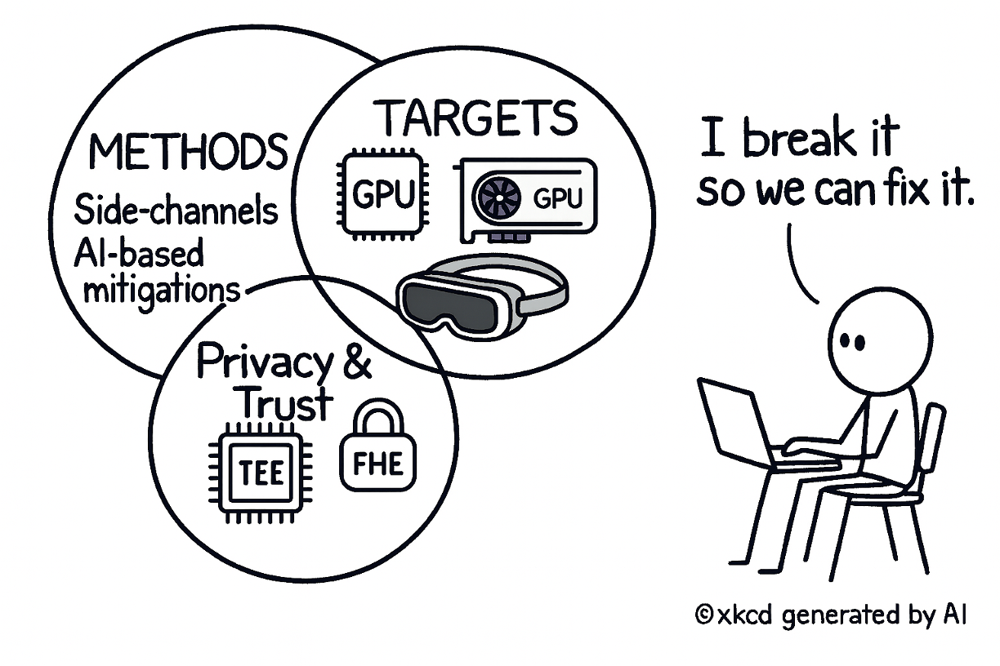

I am a Ph.D. candidate (ABD) in Computer Engineering at Iowa State University, advised by Dr. Berk Gulmezoglu in the  <a href="https://www.ece.iastate.edu/bgulmez/" style="text-decoration: none;"><b>MAIS Lab</b></a>, and I am currently a (long-term) research intern at Seagate Research Group’s Data Trust Team. 

  

My research focuses on identifying security vulnerabilities in modern computing systems and emerging computing platforms. I utilize side-channel analysis, system-level profiling, artificial intelligence (AI) driven mitigations, cryptographic methods, and trusted execution environment (TEE) integrated designs to strengthen privacy and trust guarantees in real-world applications. Those approaches span microarchitectures (Intel, AMD, and ARM) and immersive platforms (AR/VR headsets), translating vulnerability discovery into deployable defenses. In doing so, my work enhances our understanding of security issues in hardware systems and enables scalable, AI-based defenses.  

**Research focus**
  &emsp;• Hardware security, microarchitectural side channel attacks and AI-driven mitigations
  &emsp;• Cryptographic systems, including fully homomorphic encryption (FHE)
  &emsp;• Machine learning security

My work has been recognized by AMD through a security bulletin (<a href="https://www.amd.com/en/resources/product-security/bulletin/amd-sb-7024.html" style="text-decoration: none;"><b>AMD-SB-7024</b></a>) and by Meta through a bounty award, and it has appeared at top security conferences, including ACSAC, ASPLOS, and NDSS.  

<!--

  

<!--
I leverage cutting-edge AI and system-level techniques to design scalable security defenses that protect user privacy and strengthen trustworthy hardware systems.

<!--
Prior to joining Iowa State, I worked as an Assistant Manager in the ICT Infrastructure Strategy and Planning Team at South Korea’s South Korea’s National Information Society Agency (<a href="https://eng.nia.or.kr/site/nia_eng/main.do" style="text-decoration: none;"><b>NIA</b></a>).
-->

<!-- News
======
-->

News
------
**[Oct. 2025]** I gave a **talk** on "Privacy Preserving Machine Learning at the Intersection of Fully Homomorphic Encryption and Trusted Execution Environment" at the 4th bi-annual Seagate AI-Summit (global event).  

**[Oct. 2025]** Our work has been recognized by the department <a href="https://news.engineering.iastate.edu/2025/09/30/seonghun-son-advancing-hardware-and-systems-security/" style="text-decoration: none;"><b>News</b></a>. Thank you to the ECpE department for recognizing our work!  

**[Sep. 2025]** I passed my Ph.D. preliminary exam! I am officially ABD (all but defense). Deep thanks to my committee, advisor, and collaborators.  

**[Aug. 2025]** Our collaborative research **paper** with Purdue University on GPU-based side-channel attacks in XR has been accepted at NDSS 2026.  

**[Mar. 2025]** I received a Meta Bounty **Award** by reporting side-channel vulnerabilities. 

**[Feb. 2025]** I received a student travel **grant** from ASPLOS 25. 

**[Feb. 2025]** I received an **internship** offer from Seagate Research Group, Data Trust team (Cryptography and Security Research).  

**[Feb. 2025]** Our **paper** “SMaCk: Efficient Instruction Cache Attacks via Self-Modifying Code Conflicts” got accepted at ASPLOS ’25. AMD acknowledged our attack and has published a <a href="https://www.amd.com/en/resources/product-security/bulletin/amd-sb-7024.html" style="text-decoration: none;"><b>security bulletin</b></a> for our attack.  

**[Nov. 2024]** Our **poster**, "DefWeb: Defending User Privacy against Cache-based Website Fingerprinting Attacks with Intelligent Noise Injection,” got the **best poster award** at the Midwest Security Workshop 2024, organized at Purdue University. (<a href="/files/MSW_Seonghun.pdf" target="_blank" style="text-decoration: none;"><b>PDF</b></a>) 

**[Oct. 2024]** I received the Sidebottom **Scholarship** for the academic year 2024-2025. 

**[Sep. 2024]** I presented a research **poster** at the CAE-R Symposium in St Louis. 

**[Aug. 2024]** I gave an **invited talk** on "Microarchitectural Security and Machine Learning Security for Reliable Autonomous Driving Systems” at Kyungpook National University in South Korea. 

**[May. 2024]** I joined the  <a href="https://beerkay.github.io/" style="text-decoration: none;"><b>Dr.Berkay Celik's</b></a> <a href="https://pursec.cs.purdue.edu/" style="text-decoration: none;"><b>PurSec</b></a> Lab as a **research intern** during the summer.  

**[Mar. 2024]** Our **poster** on the security of Machine Learning models, in collaboration with NSA, has been accepted to the CAE symposium. I presented the poster in Kentucky 

**[Dec. 2023]** Our **paper**, "DefWeb: Defending User Privacy against Cache-based Website Fingerprinting Attacks with Intelligent Noise Injection," is accepted at ACSAC 2023  
