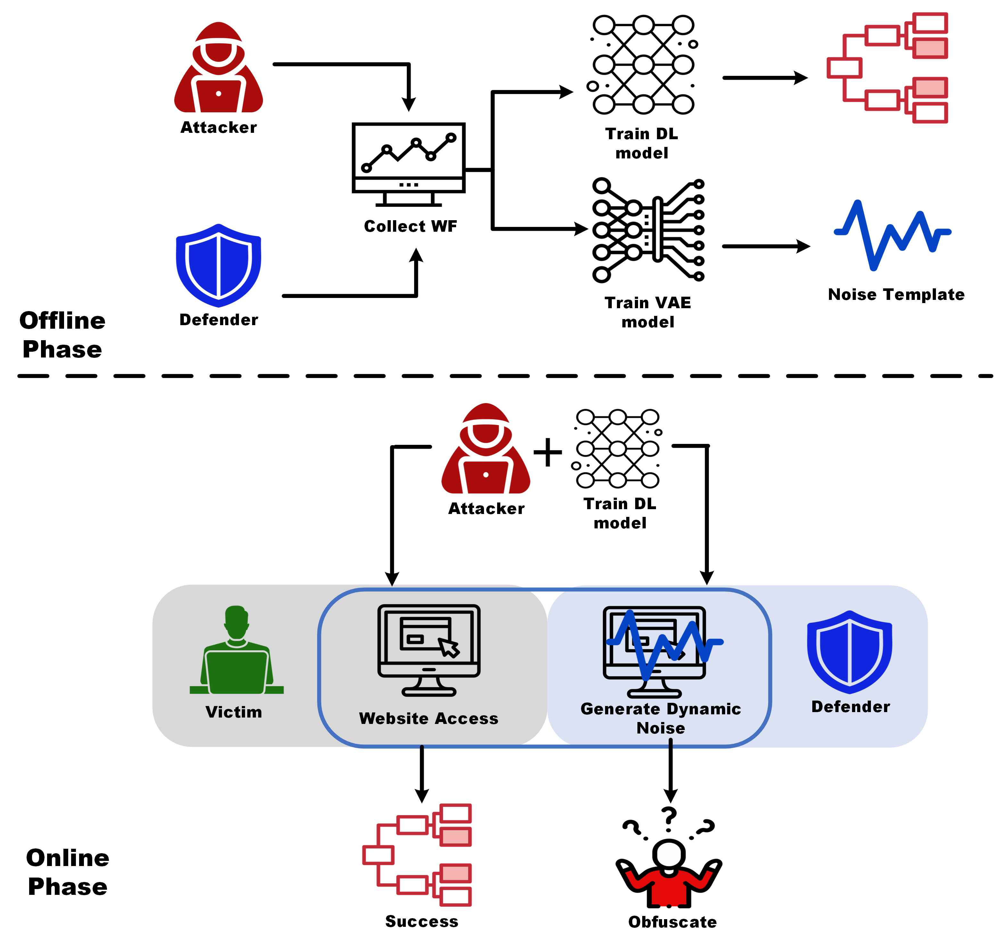
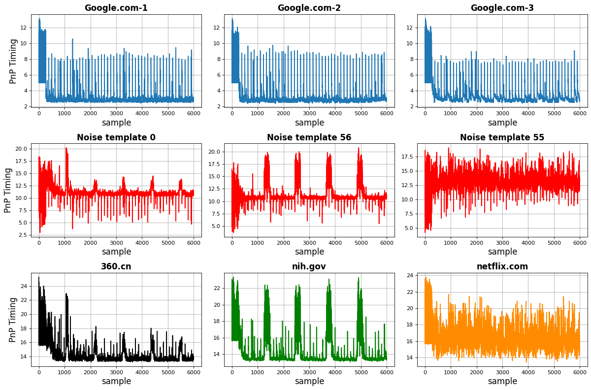
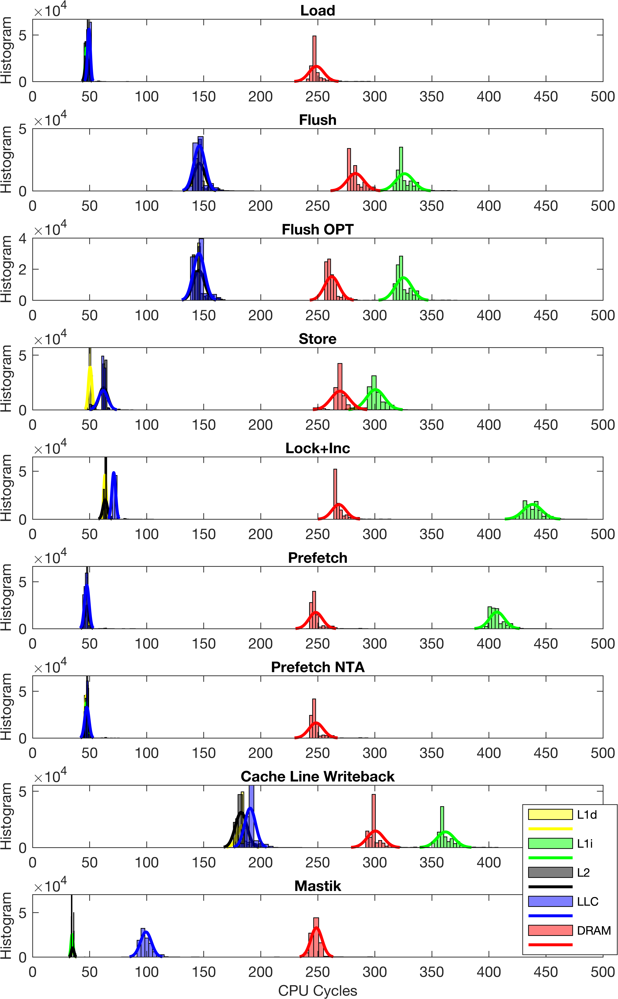
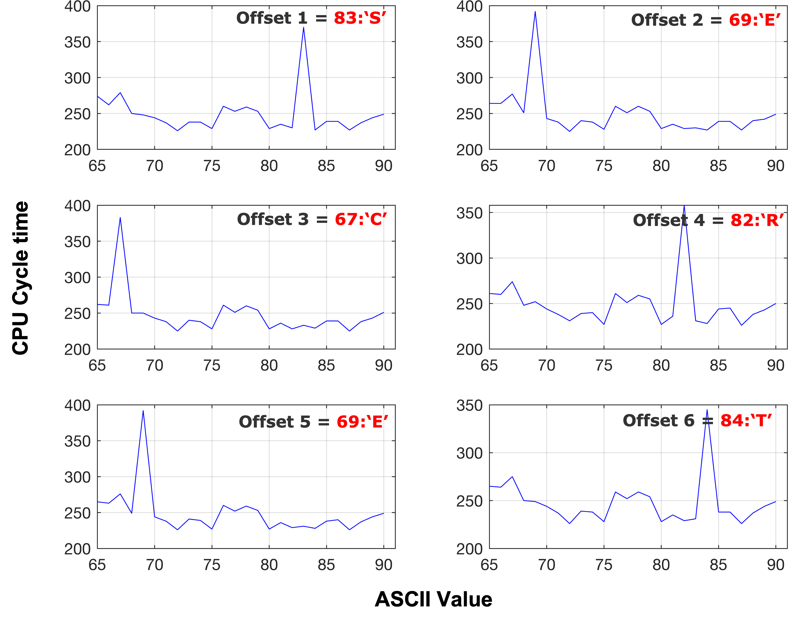
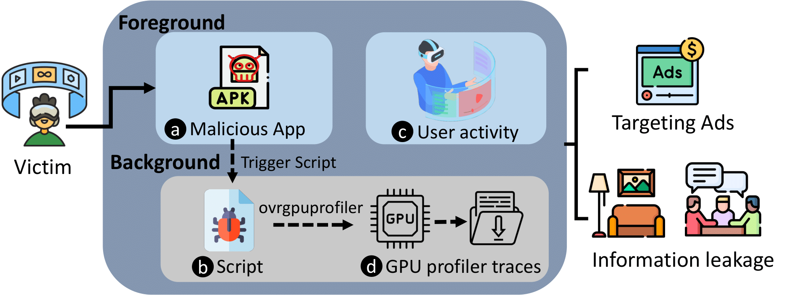
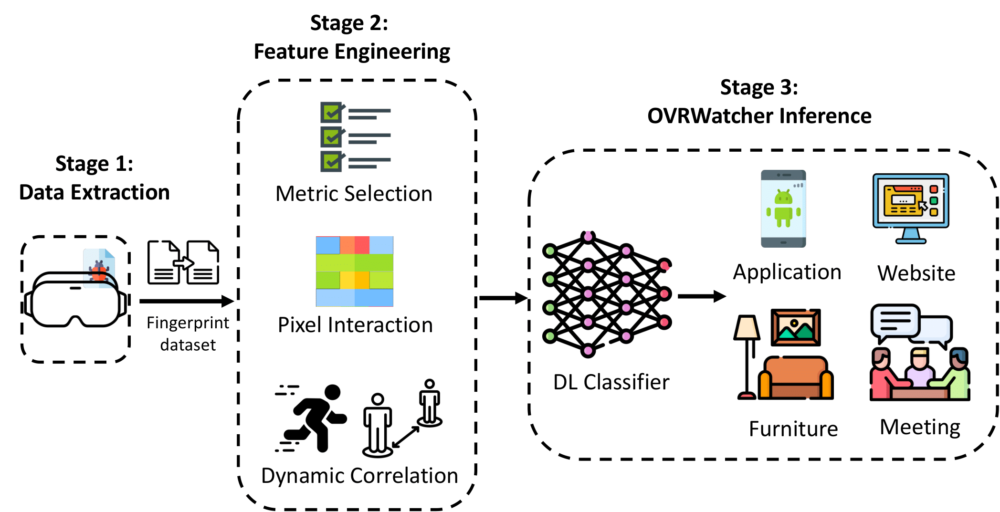
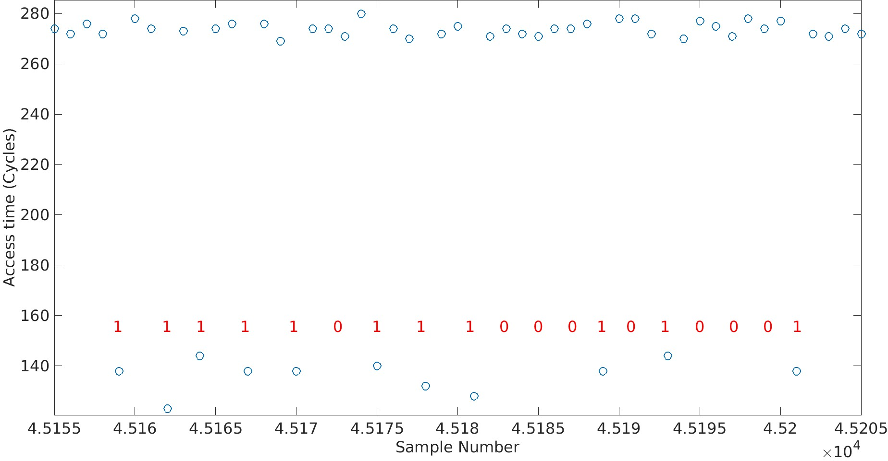
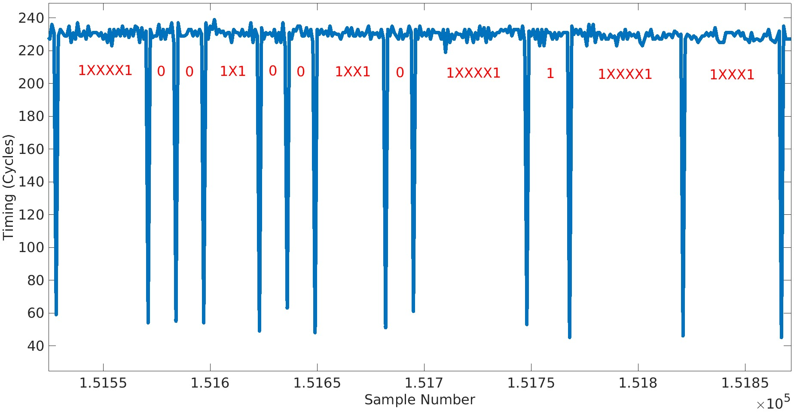
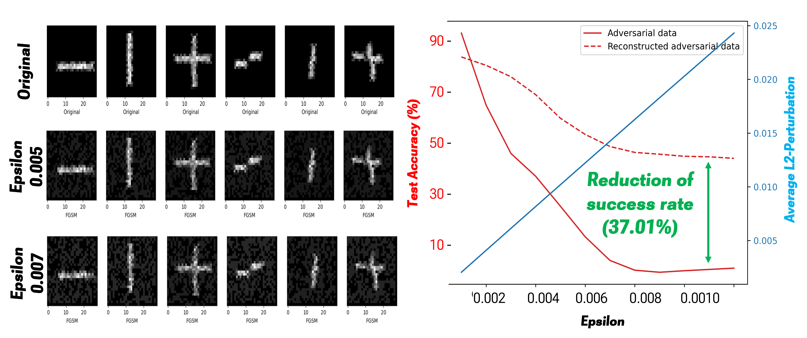
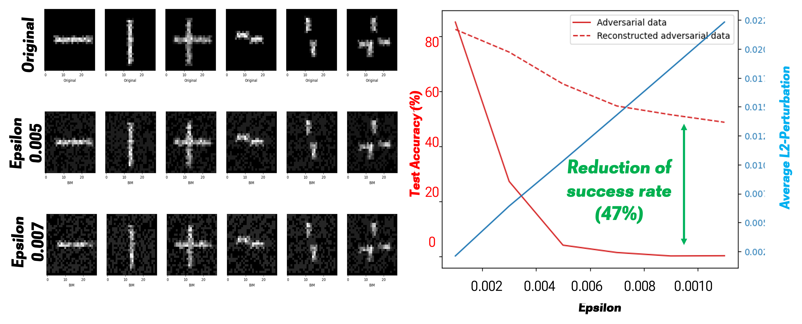

Microarchitectural Side-channel Attacks & Defense Utilizing AI
------
* Defending Side-channel Attacks by Utilizing Generative AI Algorithms.

  
  

* Investigating CPU Cache-based Attacks on Intel and AMD devices.

  
  

* Analyzing Vulnerabilities on AR/VR devices (Meta Quest, Microsoft HoloLens).

  
  

Cryptographic systems
------
* Extracting cryptographic keys (RSA Key, OpenSSL SRP)

  
  

* Exploring Cryptography (RSA Key, OpenSSL SRP, Homomorphic Encryption) Vulnerabilities.

Machine Learning Security
------
* Mitigation of Adversarial Attacks (FGSM, BIM)

  
  

* Studying Intrinsic Dimension Estimation for Enhanced Machine Learning Security.

<!-- * Ph.D in Version Control Theory, GitHub University, 2018 (expected)
* M.S. in Jekyll, GitHub University, 2014
* B.S. in GitHub, GitHub University, 2012 
Machine Learning Security
------
* Spring 2024: Academic Pages Collaborator
  * GitHub University
  * Duties includes: Updates and improvements to template
  * Supervisor: The Users

* Fall 2015: Research Assistant
  * GitHub University
  * Duties included: Merging pull requests
  * Supervisor: Professor Hub

* Summer 2015: Research Assistant
  * GitHub University
  * Duties included: Tagging issues
  * Supervisor: Professor Git
  
Skills
======
* Skill 1
* Skill 2
  * Sub-skill 2.1
  * Sub-skill 2.2
  * Sub-skill 2.3
* Skill 3

Publications
======
  <ul>
    
  </ul>
  
Talks
======
  <ul>
    
  </ul>
  
Teaching
======
  <ul>
    
  </ul>
  
Service and leadership
======
* Currently signed in to 43 different slack teams
-->
